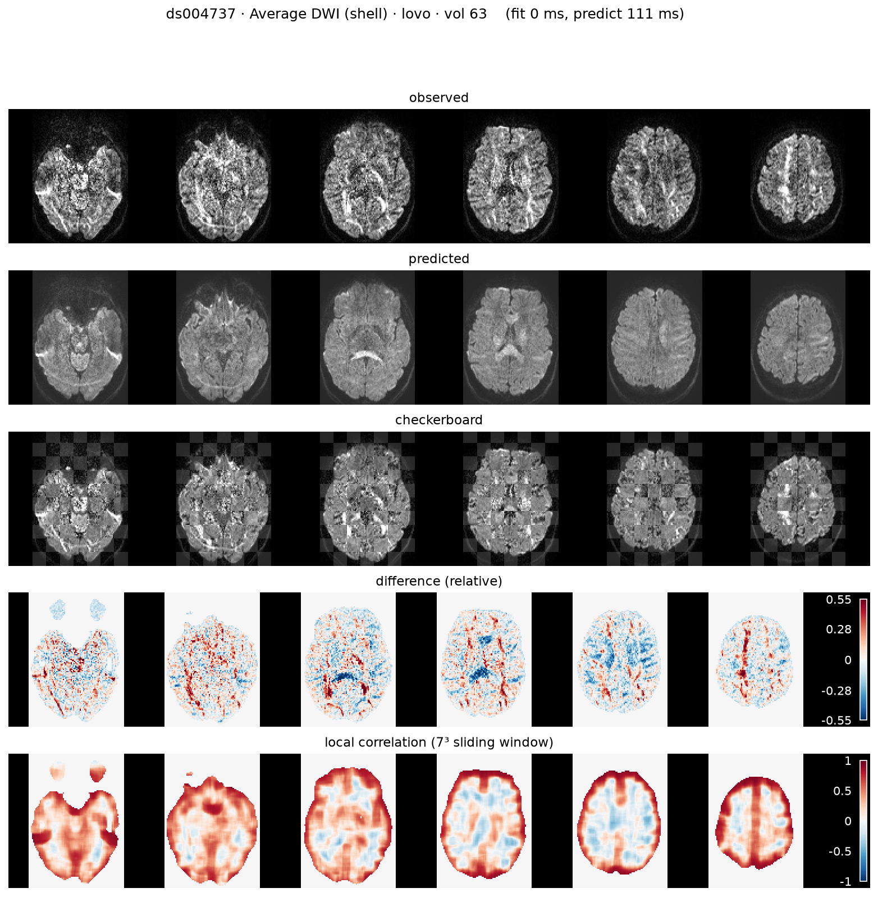
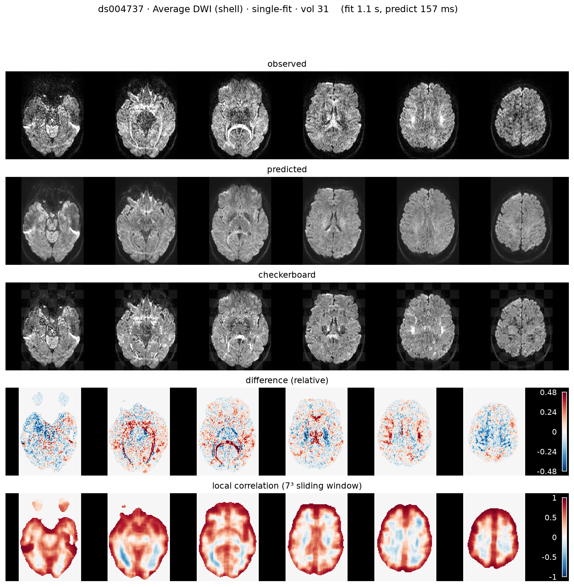
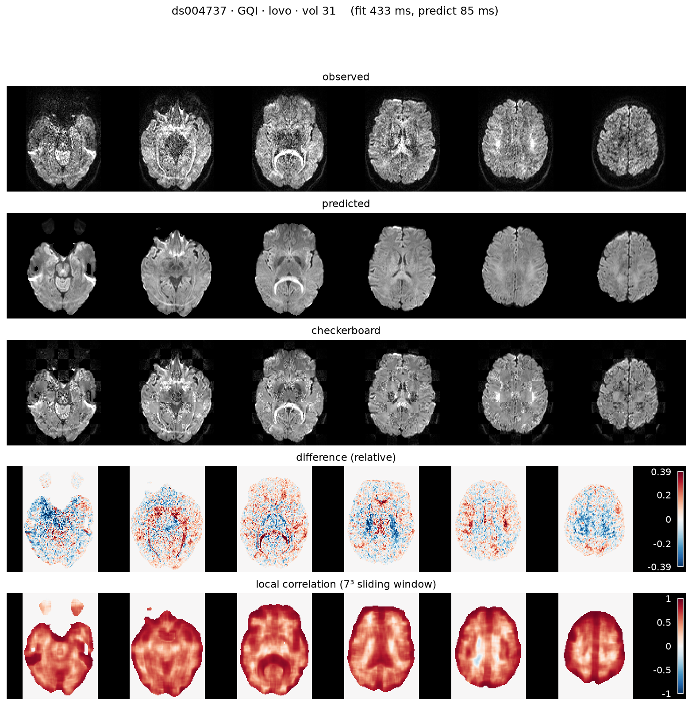
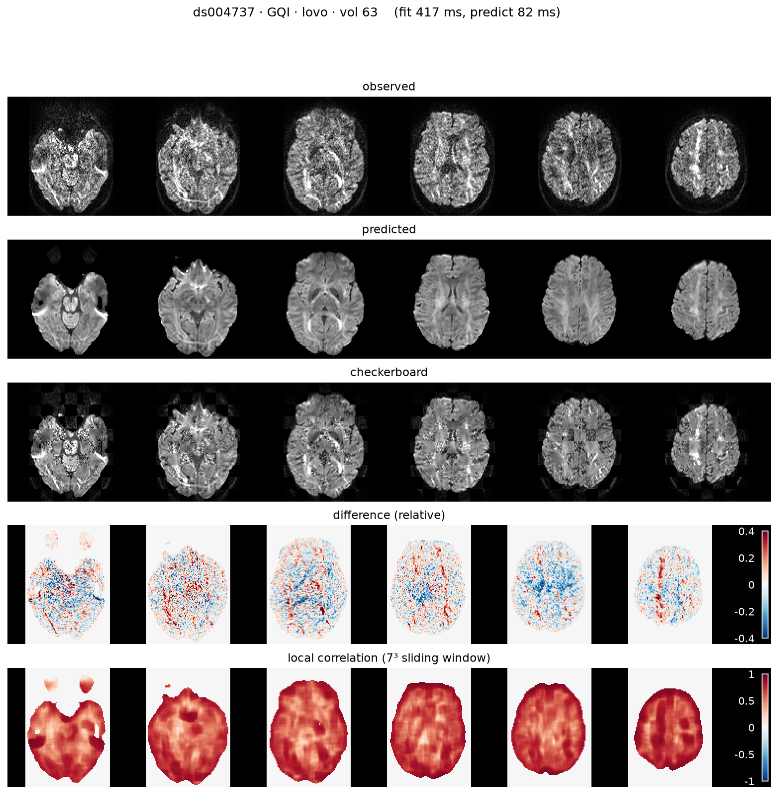
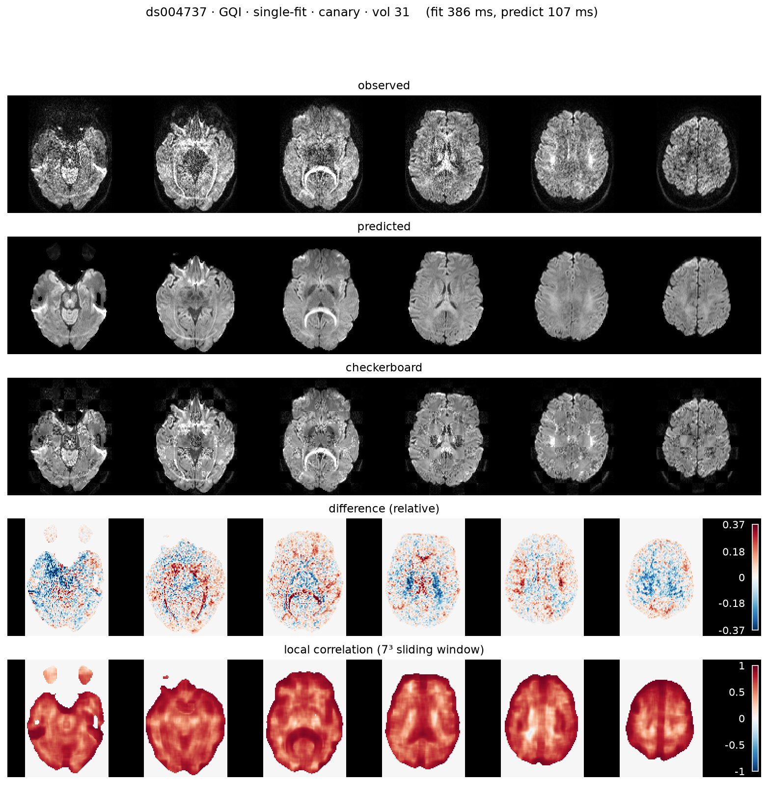
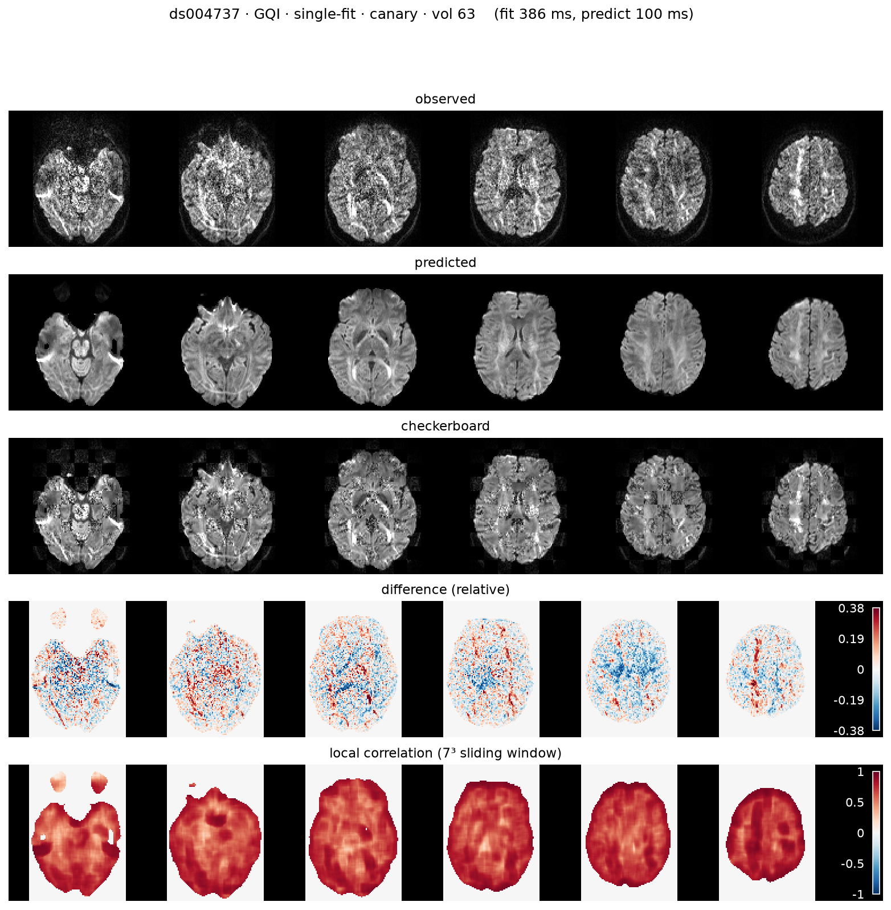

.. _gallery_ds004737:

==============
DSI (ds004737)
==============

**Source:** `OpenNeuro ds004737 <https://openneuro.org/datasets/ds004737>`__ — ``sub-001/ses-1/dwi/sub-001_ses-1_acq-HASC92_dwi.nii.gz``

.. note::

   Compressed-sensing DSI (q-space grid, HASC92), not a full 258-point grid.

Predicted diffusion volumes for the **DSI (ds004737)** dataset, across every
applicable model in both **LOVO** (leave-one-volume-out, holding out the
predicted orientation) and **single-fit** (fit once on all volumes) modes.

Coverage
--------

.. list-table:: Gallery coverage
   :header-rows: 1
   :widths: 18 14 16 12 8 32

   * - Dataset
     - Scheme
     - Model
     - Mode
     - Ran
     - Reason
   * - ds004737
     - DSI
     - average
     - lovo
     - ✓
     - 
   * - ds004737
     - DSI
     - average
     - single-fit
     - ✓
     - 
   * - ds004737
     - DSI
     - gqi
     - lovo
     - ✓
     - 
   * - ds004737
     - DSI
     - gqi
     - single-fit
     - ✓
     - 

average · lovo
--------------

average · single-fit
--------------------

gqi · lovo
----------

gqi · single-fit (canary)
-------------------------

